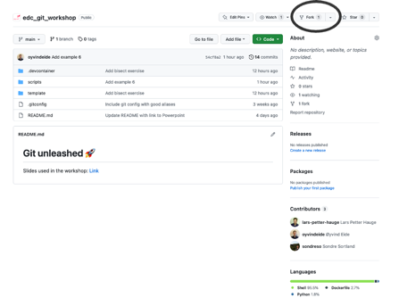
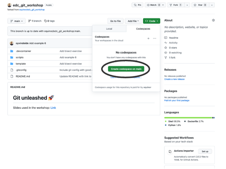

# Git unleashed 🚀

Slides used in the workshop: [Link](https://statoilsrm-my.sharepoint.com/:p:/g/personal/sonso_equinor_com/EQJAd1ZDYw5LkZeWsH4OFUkBuichpQyDGU_J910c0sQtlA?e=om9bGp) 

This workshop is about getting to know key concepts in git, and practice
them through a few exercises.

# Getting started

First, create a fork of the repository:

Then create Codespaces on your fork:

